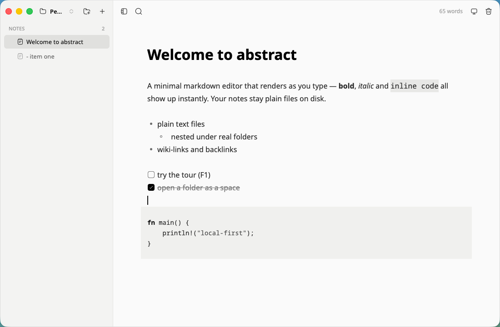
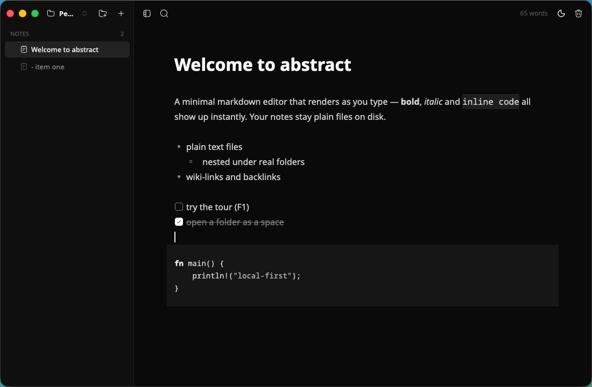

# Leadown

**A minimal, local-first markdown notes editor.**

[](https://github.com/fireflylabss/leadown/actions/workflows/ci.yml)
[](https://github.com/fireflylabss/leadown/releases)
[](LICENSE)





Your notes are plain `.md` files living in real folders on disk. No accounts, no sync daemon, no proprietary format — the folder is the app.

Leadown is a fork of [abstract](https://github.com/fireflylabss/abstract), rebranding and re-architecting it as an independent product. The original project's Apache-2.0 license and attribution are preserved.

## Features

- **Live markdown** — Typora-style rendering: bold, italic, code, links, headings, lists and tasks render inline, and the syntax conceals itself until your selection touches it.
- **HTML rendering** — Markdown is converted to sanitized HTML as an intermediate representation for display. Notes remain plain `.md` files on disk.
- **Autosave** — writes are debounced as you type; a note's file is created on the first keystroke and named after its first heading.
- **Spaces** — keep several note directories and switch between them from the sidebar.
- **Sidebar tree** — folders and notes with inline rename, plus one-click new note / new folder.
- **Task lists** — click the checkbox to toggle; **code blocks** with syntax highlighting.
- **Wiki-links** — `[[note]]` links with autocomplete; `Ctrl`/`Cmd`+click follows a link (creating the note if missing), and a backlinks panel lists references.
- **Global search** — `Ctrl`/`Cmd`+`P` opens a palette over note titles and bodies; empty query lists recently edited notes.
- **External-edit aware** — the space folder is watched live (inotify/FSEvents/ReadDirectoryChanges), so edits and deletions from other apps show up instantly.
- **Session restore** — reopens your notes, window geometry and sidebar state.
- **Cross-platform** — Linux (Wayland & X11), macOS and Windows; bundled Noto fonts for consistent rendering.
- **Interface in English and Portuguese** — auto-detected from the system locale.
- **Chromeless** — custom titlebar, monochrome light/dark themes, first-run tour.

## Architecture

Leadown uses **Rust + Tauri 2** with a web-based frontend:

- **Backend** — Rust: filesystem operations, markdown parsing, search, wiki-links, settings, session persistence.
- **Frontend** — HTML/CSS/JavaScript: UI rendering, editing, user interaction.
- **Rendering pipeline** — Markdown → parser → HTML (sanitized) → DOM → visual rendering.

The HTML is an intermediate representation only — it is never persisted to disk. Notes remain plain `.md` files.

### Tauri 2

Leadown uses [Tauri 2](https://tauri.app) as its desktop runtime. Tauri provides:

- **Native webview** — uses the OS's built-in web renderer (WebKit on macOS, WebView2 on Windows, WebKitGTK on Linux), so no Chromium is bundled.
- **Small footprint** — the entire app is a single binary, typically 3–5 MB.
- **Secure IPC** — the frontend communicates with the Rust backend only through explicit Tauri commands.
- **Native menus, dialogs, and window controls** — standard desktop UX.

### Fork

Leadown is a fork of [abstract](https://github.com/fireflylabss/abstract), rebranding and re-architecturing it as an independent product. The original project's Apache-2.0 license and attribution are preserved.

## Install

### Releases

Prebuilt artifacts are attached to each [GitHub Release](https://github.com/fireflylabss/leadown/releases):

- **Linux** — `leadown-<version>-linux-x86_64.tar.gz` (binary + docs), a `.deb`, an `.rpm`, and an `.AppImage`. aarch64 builds are available as `leadown-<version>-linux-aarch64.*`.
- **macOS** — `leadown-<version>-macos-aarch64.dmg` (Apple Silicon) / `...-macos-x86_64.dmg` (Intel): open and drag `Leadown.app` to Applications. A bare `.app.zip` is also attached. Builds are ad-hoc signed (no Apple Developer ID), so Gatekeeper blocks the first launch: right-click → **Open**, or run `xattr -dr com.apple.quarantine /Applications/Leadown.app`.
- **Windows** — `leadown-<version>-windows-x86_64.exe` (portable, just run it) or the `.zip` with README/LICENSE. SmartScreen may warn about an unknown publisher: **More info → Run anyway**.

### Arch / CachyOS (AUR)

Once published to the AUR (PKGBUILDs in [`packaging/aur/`](packaging/aur)):

```bash
paru -S leadown      # build from source
paru -S leadown-bin  # prebuilt binary
```

### Debian / Ubuntu

Download the `.deb` from the latest release, then:

```bash
sudo dpkg -i leadown_<version>-1_amd64.deb
```

### Fedora / RHEL

Download the `.rpm` from the latest release, then:

```bash
sudo dnf install ./leadown-<version>-1.x86_64.rpm
```

### AppImage

```bash
chmod +x leadown-<version>-linux-x86_64.AppImage
./leadown-<version>-linux-x86_64.AppImage
```

### From source

Rust toolchain is pinned via `rust-toolchain.toml` (rustup handles it automatically).

- **macOS** — `xcode-select --install`
- **Arch** —
  ```bash
  sudo pacman -S --needed rustup base-devel pkgconf libxkbcommon libxkbcommon-x11 \
    libxcb xcb-util-wm xcb-util-image xcb-util-keysyms xcb-util-renderutil \
    wayland alsa-lib fontconfig
  ```
- **Debian/Ubuntu** —
  ```bash
  sudo apt-get install libxcb-xkb-dev libxkbcommon-dev libxkbcommon-x11-dev \
    libxcb-icccm4-dev libxcb-image0-dev libxcb-render0-dev libxcb-shape0-dev \
    libxcb-xfixes0-dev libxcb-keysyms1-dev libwayland-dev pkg-config
  ```
- **Windows** — [rustup](https://rustup.rs) + Visual Studio Build Tools ("Desktop development with C++" workload).

Then:

```bash
cargo build --release
./target/release/leadown   # leadown.exe on Windows
```

## Keyboard

`Ctrl` on Linux/Windows, `Cmd` on macOS. Standard editing keys plus `B`/`I`/`Z`/`Shift+Z` and word jumps (`Ctrl+←/→`, `Alt+←/→` on macOS).

| Action | Linux / Windows | macOS |
| --- | --- | --- |
| New note | `Ctrl+N` | `Cmd+N` |
| New folder | `Ctrl+Shift+N` | `Cmd+Shift+N` |
| Switch space | `Ctrl+O` | `Cmd+O` |
| Save now | `Ctrl+S` | `Cmd+S` |
| Cycle theme | `Ctrl+Shift+L` | `Cmd+Shift+L` |
| Toggle sidebar | `Ctrl+\` | `Cmd+\` |
| Delete note | `Ctrl+Shift+Backspace` | `Cmd+Shift+Backspace` |
| Search notes | `Ctrl+P` or `Ctrl+Shift+F` | `Cmd+P` or `Cmd+Shift+F` |
| Rename | `F2` | `F2` |
| Tour | `F1` | `F1` |
| Quit | — | `Cmd+Q` |

Tour navigation: `Enter`/`→` next, `←` back, `Esc` skip.

## Development

```bash
cargo fmt --check
cargo clippy --all-targets -- -D warnings
cargo test
cargo build --release
```

## License

Apache-2.0 — see [LICENSE](LICENSE).

Leadown is a fork of [abstract](https://github.com/fireflylabss/abstract) by fireflylabs, distributed under the Apache License 2.0. The original project's copyright and attribution are preserved.

Bundled Noto Sans / Noto Sans Mono fonts are licensed under the SIL Open Font License 1.1 — see [assets/fonts/OFL.txt](assets/fonts/OFL.txt).
